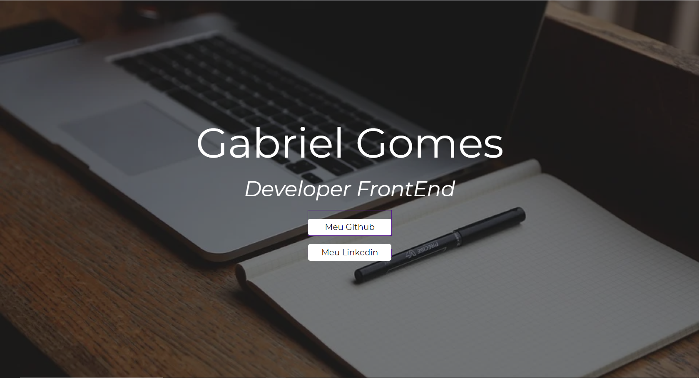

# Landing Page
Primeiro website criado, com fins didáticos, para o curso de desenvolvimento de sistemas do [SENAI Jandira](https://jandira.sp.senai.br/), com orientação do professor Fernando Leonid.

## O que é uma Landing Page?
São páginas com foco principal de conversão dos visitantes. Assim, essas páginas de conversão possuem poucos elementos comparados com páginas tradicionais, evitando distrações e garantindo o objetivo.

## WebSite
O site pode ser acessado pelo link:
[Gabriel Gomes](https://gabshh.github.io/landing-page-a/)

## Tecnologias
* HTML5
* CSS3

## Screenshot
